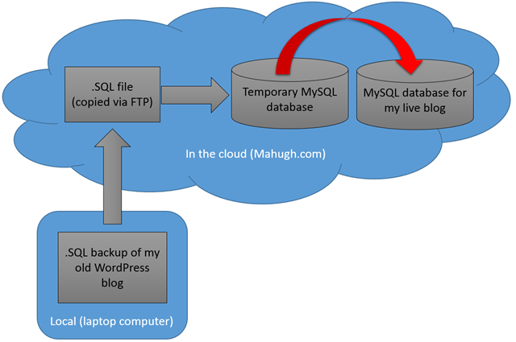

# wordpress-migration

This repo contains a set of PHP programs that were used to consolidate all of my blog posts from multiple platforms over the years into a single WordPress database as described in this blog post: [https://www.dougmahugh.com/consolidating-blogs/](https://www.dougmahugh.com/consolidating-blogs/)

